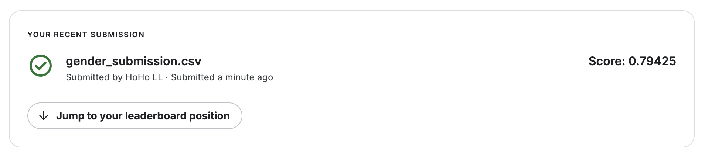

# Titanic - Machine Learning from Disaster

Author: [1chooo](https://1chooo.com)

## My Result

Baseline: 0.79425

## What I have tried?

1. 
   In the progress, I have tried using the "Random Forest" model, but it was less accurate than the baseline. 
   
   To improve the accuracy, I searched for various methods and found the article "Titanic Competition: Journey to 100% Accuracy". 
   
   In this article, the author pre-processed many variables, especially "Name," "Sex," "SibSp," "Parch," and "Age." He/She combined the names into new titles and considered the correlation between age and sex. This led to increased accuracy in the Random Forest model. 
   
   Overall, I learned that imbalanced data can negatively impact the accuracy of "Random Forest" and can lead to overfitting due to the presence of noise. To improve the accuracy of the model, I must be more careful in observing data types and ensure the data is balanced.

2. 
   Finally, the only selection was to combine 'SibSp', 'Parch' and still implemented through gradient boosting model. At first, when I saw this method, I thought it was quite cool. 
   
   After all, having children and having relatives are two relationships with a lot of possibilities, and it is possible that there are overlapping possibilities. So, combining them together is a choice that may be worth trying to deal with the data.

## Reference

- [Titanic Competition [Journey to 100% Accuracy]](https://www.kaggle.com/code/amerwafiy/titanic-competition-journey-to-100-accuracy)
- [[機器學習專案] Kaggle競賽-鐵達尼號生存預測(Top 3%)](https://yulongtsai.medium.com/https-medium-com-yulongtsai-titanic-top3-8e64741cc11f)
- [[資料分析&機器學習] 第4.1講 : Kaggle競賽-鐵達尼號生存預測(前16%排名)](https://medium.com/jameslearningnote/%E8%B3%87%E6%96%99%E5%88%86%E6%9E%90-%E6%A9%9F%E5%99%A8%E5%AD%B8%E7%BF%92-%E7%AC%AC4-1%E8%AC%9B-kaggle%E7%AB%B6%E8%B3%BD-%E9%90%B5%E9%81%94%E5%B0%BC%E8%99%9F%E7%94%9F%E5%AD%98%E9%A0%90%E6%B8%AC-%E5%89%8D16-%E6%8E%92%E5%90%8D-a8842fea7077)
